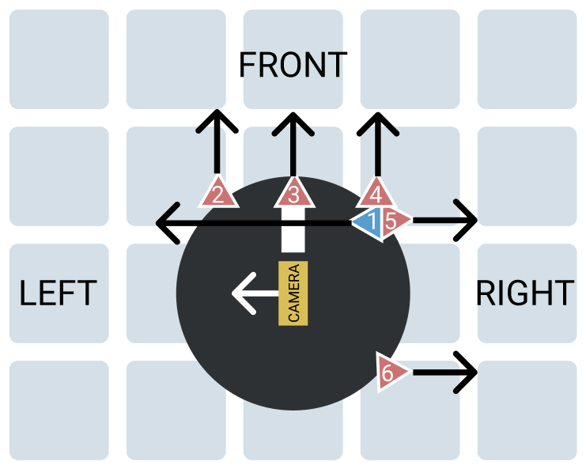

# Robot Setup

# Arduino
## Update Turn Values
### Decrease Left Turn Value
- Android -> RPi -> Arduino: `(`
- Arduino -> RPi -> Android: `(:<new_left_turn_value>` 
    - Arduino decreases the left turn value by 0.5
    - e.g. `(:89.5`

### Increase Left Turn Value
- Android -> RPi -> Arduino: `<`
- Arduino -> RPi -> Android: `<:<new_left_turn_value>` 
    - Arduino increases the left turn value by 0.5
    - e.g. `<:90.5`

### Decrease Right Turn Value
- Android -> RPi -> Arduino: `)`
- Arduino -> RPi -> Android: `):<new_right_turn_value>` 
    - Arduino decreases the right turn value by 0.5
    - e.g. `):89.5`

### Increase Right Turn Value
- Android -> RPi -> Arduino: `>`
- Arduino -> RPi -> Android: `>:<new_right_turn_value>` 
    - Arduino increases the right turn value by 0.5
    - e.g. `>:90.5`

## Sensor Request
- Algo -> RPi -> Arduino: `S`
- Arduino -> RPi -> Algo: `S:<sensor_1>,<sensor_2>,<sensor_3>,<sensor_4>,<sensor_5>,<sensor_6>`
    - e.g. `S:1,2,1,2,1,2`
    - Sensor order is in the robot setup
        - Red: Short range sensor
        - Blue: Long range sensor
        - Ordered in the clockwise direction starting from the left-facing sensor
    - Sensor values
        - `-1`: Lower than lower range (within blindspot)
        - `0`: Higher than upper range
        - `1-5`: How many blocks away is the nearest obstacle (1: Right next to robot)

## Calibration Request
### From Android
- Android -> RPi -> Algo: `C`
    - To start the calibration algorithm
    - Algo will turn robot to face south and west walls around start pos for calibation

### Calibrate with Front Facing Sensors (Sensors 2 & 4)
- Algo -> RPi -> Arduino: `f`
- Arduino -> RPi -> Algo: `f`
    - Send after calibration is finished
    - Calibrate the front facing sensors 2 & 4 with the wall (sensor value = 1)

### Calibrate with Right Facing Sensors (Sensors 5 & 6)
- Algo -> RPi -> Arduino: `r`
- Arduino -> RPi -> Algo: `r`
    - Send after calibration is finished
    - Calibrate the right facing sensors 5 & 6 with the wall (sensor value = 1)

## Set Speed Request
### Low (Turtle) Speed (For Exploration)
- Algo -> RPi -> Arduino: `T`
- Arduino -> RPi -> Algo: `T`
    - Send after speed has been updated to low speed

### High (Hare) Speed (For Fastest Path)
- Algo -> RPi -> Arduino: `H`
- Arduino -> RPi -> Algo: `H`
    - Send after speed has been updated to high speed

# Android
## Set Starting Point (Reposition Robot)
- Android -> RPi -> Algo: `R:x,y <direction>`
    - e.g. `R:1,2 N`: Reposition to position (1, 2) facing north
    - Send whenever the starting point position or direction is updated

## Set Waypoint
- Android -> RPi -> Algo: `W:x,y`
    - e.g. `W:2,12`: Set waypoint to (2, 12)

## Prematurely End Exploration or Algorithm
- Android -> RPi -> Algo: `Q`
    - If exploration is running, end exploration
    - If fastest path is running, end fastest path

# RPi
## Hello Message
- Algo -> RPi: `HELLO`
    - Sent at the beginning to establish connection
- RPi -> Algo: `HELLO TEAM`

## Photo Request
### If There's a Middle Obstacle Right in Front
- Algo -> RPi: `P:Y x,y,direction`
    - e.g. `P:Y 8,0,1`: Take photo and the coordinates of the middle obstacle is (8, 0) with the obstacle's East side facing the obstacle (i.e. robot facing south with right facing camera)
    - Directions (where the image is facing outwards to)
        - 0: North
        - 1: East
        - 2: South
        - 3: West

### Otherwise
- Algo -> RPi: `P:N x,y,direction`
    - e.g. `P:N 1,2,1`: Take photo and the coordinates of the robot is (1, 2) with the robot facing East
    - Directions (of robot)
        - 0: North
        - 1: East
        - 2: South
        - 3: West

## Image Recognition Result
- RPi -> Android: `I:x,y <image ID>`
    - e.g. `I:4,5 3`: Right arrow on obstacle at position (4, 5)
    - Image ID is based on the list provided by NTU
    - If RPi doesn't know the position of the image, do not send this message
        - Just display on the PC

# Everyone
## Movement Messages
### From Algo
- Algo -> RPi -> Android: `M:<movement> x,y <direction>`
    - e.g. `M:1 2,1 E`: Move forward one step and you will be in position (2, 1) facing East
    - Position and direction are for after the movement is completed
- RPi -> Arduino: `movement` (character as position 2)
    - e.g. `1` for `M:1 2,1 E`, `R` for `M:R 2,1 E`
- Arduino -> RPi -> Algo: `S:<sensor_1>,<sensor_2>,<sensor_3>,<sensor_4>,<sensor_5>,<sensor_6>`
    - e.g. `S:1,2,1,2,1,2`
    - Sensor order is in the robot setup
        - Red: Short range sensor
        - Blue: Long range sensor
        - Ordered in the clockwise direction starting from the left-facing sensor
    - Sensor values
        - `-1`: Lower than lower range (within blindspot)
        - `0`: Higher than upper range
        - `1-5`: How many blocks away is the nearest obstacle (1: Right next to robot)

### From Android
- Android -> RPi: `M:<movement>`
    - e.g. `M:1`: Move forward one step
- RPi -> Arduino: `<movement>` (character as position 2)
    - e.g. `1` for `M:1` (move forward one step), `R` for `M:R` (turn right)

## Map Descriptor Format
- Algo -> RPi -> Android: `D:<explored string>,<obstacle string>`
    - e.g. `D:FFFFFFFFFFFFFFFFFFFFFFFFFFFFFFFFFFFFFFFFFFFFFFFFFFFFFFFFFFFFFFFFFFFFFFFFFFFF,000000000400000001C800000000000700000000800000001F80000700000000020000000000`
    - Based on the format provided by NTU
    - Explored string and obstacle string will be concatenated with a comma
    - Arduino can ignore this message

## Exploration
- Android -> RPi -> Algo: `E`
    - Sent to start exploration
- Algo -> RPi -> Android: `E`
    - Sent when exploration is complete
- Arduino can ignore these messages

## Fastest Path
- Android -> RPi -> Algo: `F`
    - Sent to start fastest path
- Arduino can ignore these messages

# Terminology
## Positions
- x: Column
- y: Row
- Start position: (1, 1)
- Goal position: (13, 18)

## Directions
- N: North
- E: East
- S: South
- W: West
- Start position is at the most South West
- Goal position is at the most North East

## Movements
- 1-9: Forward x steps
    - e.g. 2: Move forward 2 times
    - The maximum number of forward steps in a row will be 9
- R: Rotate right
- B: Backward
- L: Rotate left

## Messages
- Sender -> Receiver
    - Sender sends message to receiver
- Sender -> Forwarder -> Receiver
    - Sender sends message to forwarder
    - Forwarder sends the same message to receiver