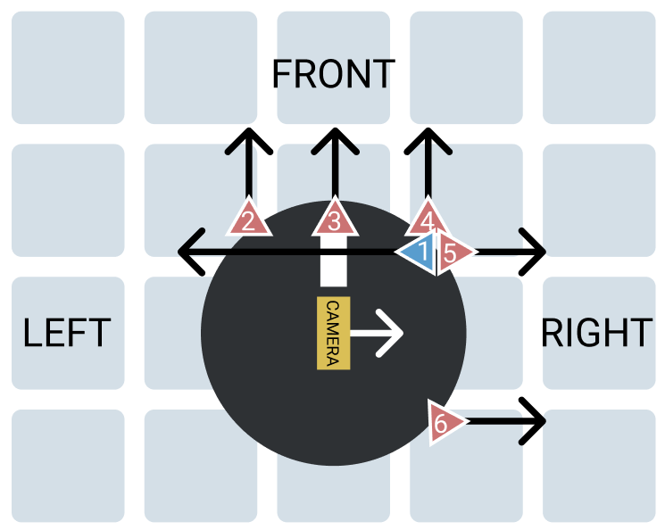

# Robot Setup

# Arduino
## Interactions
### Sensor Request
- You will receive: `S`
- Desired response: `S:<sensor_1>,<sensor_2>,<sensor_3>,<sensor_4>,<sensor_5>,<sensor_6>`
    - e.g. `S:1,2,1,2,1,2`
    - Sensor order is in the robot setup
        - Red: Short range sensor
        - Blue: Long range sensor
        - Ordered in the clockwise direction starting from the left-facing sensor
    - Sensor values
        - `-1`: Lower than lower range (within blindspot)
        - `0`: Higher than upper range
        - `1-5`: How many blocks away is the nearest obstacle (1: Right next to robot)

# Android
## Send
- Start exploration: `E`
- Start fastest path: `F`
- Reposition: `R:x,y <direction>`
    - e.g. `R:1,2 N`: Reposition to position (1, 2) facing north
- Set waypoint: `W:x,y`
    - e.g. `W:2,12`: Set waypoint to (2, 12)

# RPi
## Receive
- Hello message: `HELLO`
    - Sent at the beginning to establish connection

## Interactions
### Photo Request
- You will receive: `P`
- Desired response: `P`
    
# Everyone
## Receive
- Move: `M:<movement> x,y <direction>`
    - e.g. `M:F 2,1 E`: Move forward and you will be in position (2, 1) facing East
    - Position and direction are for after the movement is completed
- Map Descriptor Format: `D:<explored string>,<obstacle string>`
    - e.g. `D:FFFFFFFFFFFFFFFFFFFFFFFFFFFFFFFFFFFFFFFFFFFFFFFFFFFFFFFFFFFFFFFFFFFFFFFFFFFF,000000000400000001C800000000000700000000800000001F80000700000000020000000000`
    - Based on the format provided by NTU
    - Explored string and obstacle string will be concatenated with a comma

# Terminology
## Positions
- x: Column
- y: Row
- Start position: (1, 1)
- Goal position: (13, 18)

## Directions
- N: North
- E: East
- S: South
- W: West
- Start position is at the most South West
- Goal position is at the most North East

## Movements
- F: Forward
- R: Rotate right
- B: Backward
- L: Rotate left